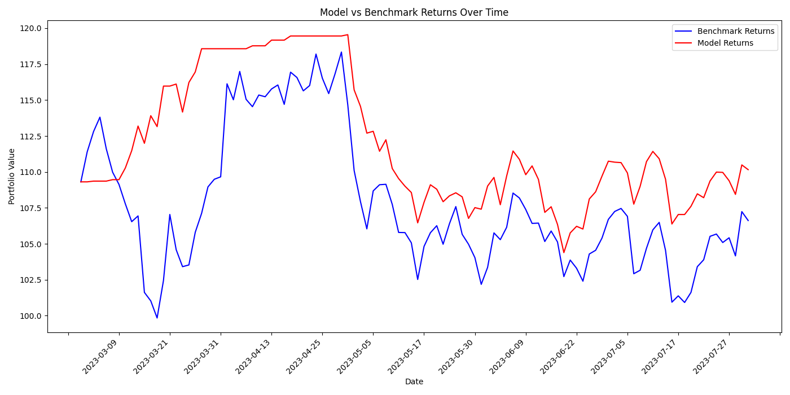
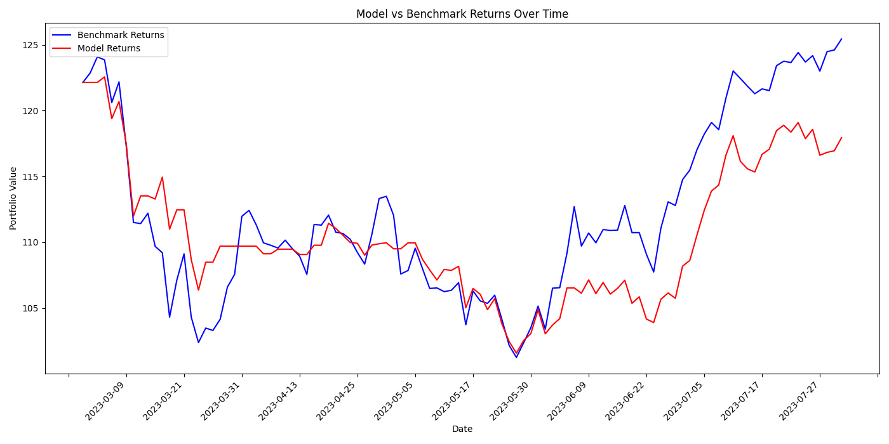
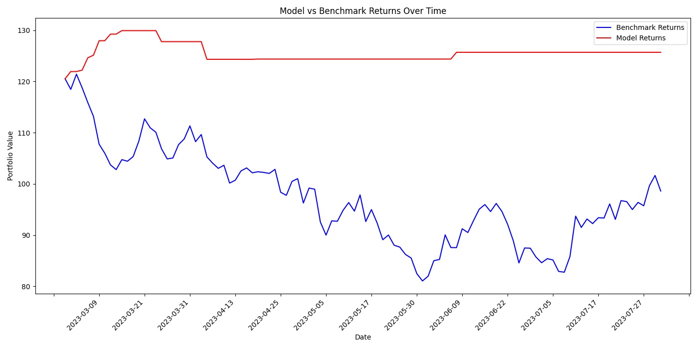

# Stock Price Predictor:
## Description
### Overview:
This project allows users to predict the next day's highs for a specific stock, given sentiment-scored news data and historic financial and economic data as well as technical indicators. It does this by using a Recurrent Neural Network with Long Short-Term Memory cells for price prediction. Sentiment analysis is done by comparing embeddings from DistilBERT through cosine similarity, and historic financial and economic data is gathered through the yfinance API and the FRED API, with technical data being calculated via TALib. 

Note: Some news data has been collected from this Kaggle dataset: https://www.kaggle.com/datasets/suruchiarora/top-25-world-news-2018-2023?resource=download. Default data goes back to mid-June 2018 - some data is unavailable prior to this.
### Structure:
This project operates by first prompting users to select a ticker, then automatically updating aggregated economic and news data, then allowing users the option to update/create stock-specific data and train/create models, and finally letting users run their models by predicting next day highs for specific dates, seeing test data performance visualized, and allowing users to run backtests to see model performance in trading.

The project is run through the `app.py` file.

Collective world and news data is aggregated through classes in the `econ.py` and `news.py` files
The `news.py` file checks the `WorldNewsData.csv` file for its latest entry, and updates it to the current day by grabbing news article URLs from GDELT, and inferring their headlines.
The `econ.py` file checks the `WorldEconomicData.csv` file for its latest entry, and updates it to the current day by grabbing economic data from the FRED API and yfinance.
Data gathered for this includes the 5 year breakeven inflation rate, the federal funds rate, S&P 500 performance, EUR/USD exchange rate, and closes for various sector ETFs.

Stock-specific data is created/updated through a class in the `data.py` file. This file stores sentiment scores of a given stock, financial data, fundamental data, technical indicators, and relevant economic information in a csv file found in the `/data` directory. This file is used by models for processing, training, and prediction.
This class generates a sentiment score for each day by processing the day's news headlines (from `WorldNewsData.csv`) through DistilBERT and comparing its embeddings with embeddings of positively and negatively modified versions of itself through Hugging Face's DistilBERT. It uses yfinance to gather the Open, Close, High, Low, and Volume of the stock for each day, as well as Forward PE. TALib is used to calculate RSI, MACD, and MACD Signal. The class uses data from `WorldEconomicData.csv` to include the above mentioned economic data (excluding irrelevant sector ETFs). Finally, the class also adds a column indicating whether the next day is a NYSE trading day.

The models are handled and run through a class in the `model.py` file. The models, which are Recurrent Neural Networks with Long Short-Term Memory cells, are implemented through TensorFlow's Keras and are trained, tested, and runs on the above stock-specific data. They use 2 LSTM layers with 50 neurons each, and 2 dropout layers with 20% dropout to prevent overfitting. The models are trained on 90% of the data, and tested on the remaining 10%. They use the Adam optimizer with a learning rate of 0.001, and have customizable epochs and batch size parameters.
The project allows for the model to be saved into the `/data` directory, and loaded for further training or usage.

The project allows the user to run their models to predict next day highs given a date, to see the model's performance on test data vs. actual, and to perform backtests over a custom date range (assuming data in appropriate csv present for all dates in the range).
The backtest compares the model's performance by comparing a benchmark buy-and-hold strategy to a strategy involving buying a stock at open if predicted high is to beat opening price, and either selling at predicted high or at close.
### Performance:
The below numbers represent performance of models located in the `/sample` directory using the provided backtest functionality on date range 2023-03-01 to 2023-08-01. This date range was unseen during training (by the provided models), but it was used in the test set.

```
Ticker: XOM

Benchmark Returns: -2.46%

Model Returns: 0.78%
```

```
Ticker: SPG

Benchmark Returns: 2.70%

Model Returns: -3.43%%
```

```
Ticker: ETSY

Benchmark Returns: -18.19%

Model Returns: 4.29%
```


As shown, the model outperformed the benchmark in 2 of 3 cases, with significant outperformance on the final case. However, this is not indicative of future performance, and is not indiciative of performance across all tickers, or even a diversified portfolio - this section is simply to provide an example of performance evaluation on sample data.
## Usage:
### Use:
This project can be run locally through a simple command-line interface. To run this project, simply follow setup instructions and run `app.py`.

For testing purposes, users can run an instance of the app in code via the `.run(scoreToggle=False)` method if wish choose to disable sentiment scoring (as this can be very time consuming over large time periods).
### Setup:
Clone this repository, and install necessary libraries via:

`pip install -r requirements.txt`

This project requires a free FRED API key (https://fred.stlouisfed.org/docs/api/api_key.html). Create a .env file in the project's root directory and store your API key in it as such:
```
FRED_KEY='[key]'
```

If you would like to use the provided sample data, then simply move the '.csv' and '.h5' within the `/sample` directory to the `/data` directory. If not, feel free to generate your own data.

